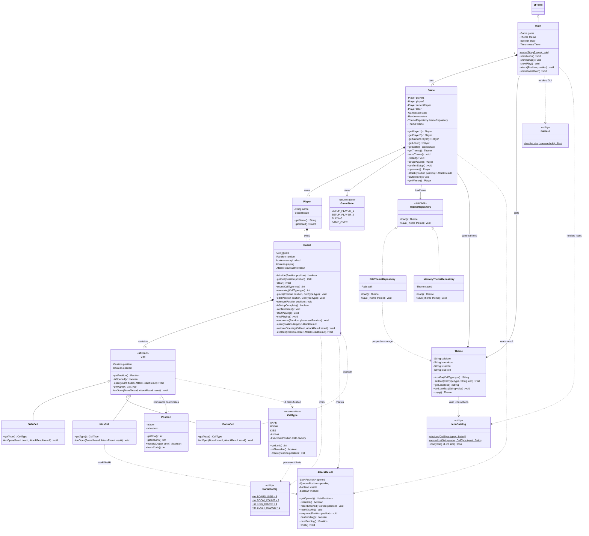

# Boom Boom Kiss — Class Diagram OOP

Cập nhật ngày 08/10/2026 theo yêu cầu Template Method, đóng gói và ba package.
Sơ đồ mô tả source hiện tại. Constructor và một số
helper private vẽ Swing được lược bỏ. `-` private, `~` package-private,
`#` protected, `+` public; `$` static, `*` phương thức abstract.

- `boomboomkiss.model`: Game, Player, Board, Cell và các lớp con, CellType,
  Position, AttackResult, Theme, GameState; Main/GameUi/IconCatalog và các test.
- `boomboomkiss.config`: GameConfig.
- `boomboomkiss.repository`: ThemeRepository, FileThemeRepository, MemoryThemeRepository.

Main là điểm khởi tạo chọn FileThemeRepository. Game chỉ import interface
ThemeRepository và nhận dependency qua constructor; không khởi tạo repository
cụ thể. Sơ đồ phụ thuộc package nằm trong `PACKAGE_DIAGRAM.mmd`.

## Template Method và đa hình

`Cell.open(Board, AttackResult)` là **final**: kiểm tra board/attack, bỏ qua
ô đã mở, đánh dấu opened, ghi Position vào kết quả, sau đó gọi `onOpen()`.
`onOpen()` là **protected abstract**. SafeCell không tạo hiệu ứng; BoomCell
gọi Board.explode(); KissCell gọi result.markKissHit(). Board.open() duyệt
hàng đợi và chỉ gọi cell.open(), không dùng if/switch theo CellType để chọn
hành vi. `getType()` dùng cho giao diện/đếm bánh và setup, không quyết định
hành vi khi mở ô.

Khi setup, `CellType.create()` dùng factory cho từng enum value. Board không
chia nhánh theo loại để tạo hoặc mở ô; kiểm tra giới hạn qua type.getLimit().

## Đóng gói và hợp đồng ngoại lệ

Position là final class với `private final int row/column`, chỉ có getter.
Tất cả thuộc tính Cell, Board, Position, AttackResult đều private. Danh sách
`AttackResult.getOpened()` không cho sửa; kết quả hoàn tất không nhận ghi
thêm. Config dùng static final cho hằng số dùng chung.

Board.place() trả void; tọa độ ngoài bàn, type null/Safe hoặc đặt trùng ném
IllegalArgumentException; vượt giới hạn hoặc sửa bàn đã xác nhận ném
IllegalStateException. Board.open()/Game.attack() chặn sai giai đoạn và ô
đã mở. Board.edit() kiểm tra trước để không làm mất quân cũ khi chọn sai.
GUI bắt các ngoại lệ này để báo cho người dùng; model không return false hay
nuốt lỗi. Lỗi đọc/ghi file theme được báo qua IllegalStateException.

## Phụ thuộc abstraction

Game nhận ThemeRepository qua constructor, load theme và saveTheme() thông
qua interface. FileThemeRepository và MemoryThemeRepository là hai hiện thực.
Main chọn FileThemeRepository ở điểm khởi tạo ứng dụng, rồi dùng Game và
Theme; luật chơi không phụ thuộc cách lưu file cụ thể. Các test dùng repository
trong bộ nhớ để không ghi đè punishment text cá nhân.
