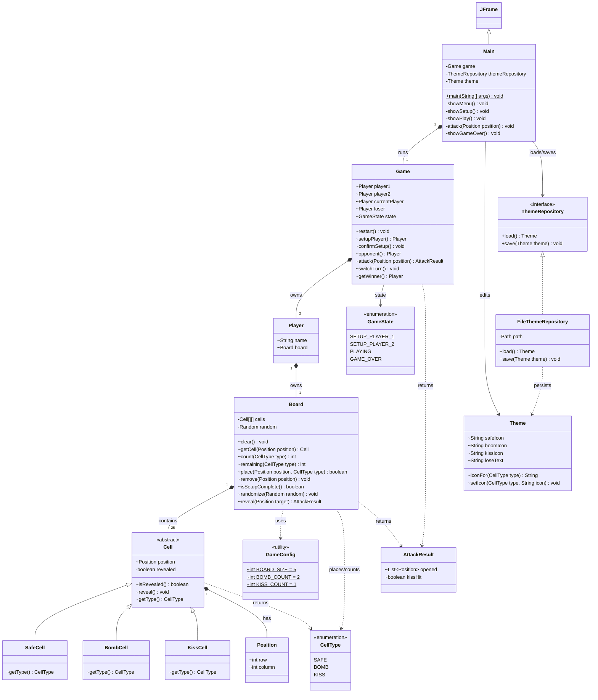

# Boom Boom Kiss — Class Diagram

Sơ đồ kiến trúc của source trong package `boomboomkiss`, cập nhật 07/10/2026.
Ký hiệu `~` là package-private, `-` là private và `+` là public. `$` đánh dấu
thành viên static. Sơ đồ hiển thị các thành phần chính; constructor và các
helper private của Swing không liệt kê hết.

## Quy ước với phần code

`Game.currentPlayer`, các phương thức trả về `Player`/`AttackResult`, và kế
thừa `Main extends JFrame` đúng như ảnh sơ đồ được cung cấp. `Board.reveal()`
nhận đúng một `Position`; `Cell` chỉ có `isRevealed()`, `reveal()`, `getType()`.
`getType()` được override ở ba lớp con và được Board gọi qua kiểu cha Cell.

Ba thuộc tính GameConfig là `static final` trong Java: cấu hình chung, không
đổi theo từng đối tượng. Chúng được đánh dấu static trên sơ đồ; `final` có
nghĩa read-only cho thuộc tính, không phải phạm vi truy cập. Ký hiệu `~` tự nó
không xác định có hay không có `static`/`final`.

Hai điều chỉnh so với ảnh cũ để khớp yêu cầu final: bỏ `selectedPiece` vì người
chơi chọn ngay trên ô; thêm `safeIcon`/`boomIcon` vì người dùng được chọn ba
icon riêng. GameUi và IconCatalog là lớp hỗ trợ vẽ giao diện/icon. Main vẫn
có helper private và trạng thái Timer để xử lý mở ô; Board có hàm private
`enqueueBlast()` cho nổ lan. Các chi tiết này được giản lược trên sơ đồ tổng
quan, không phải xóa chức năng khỏi code.
