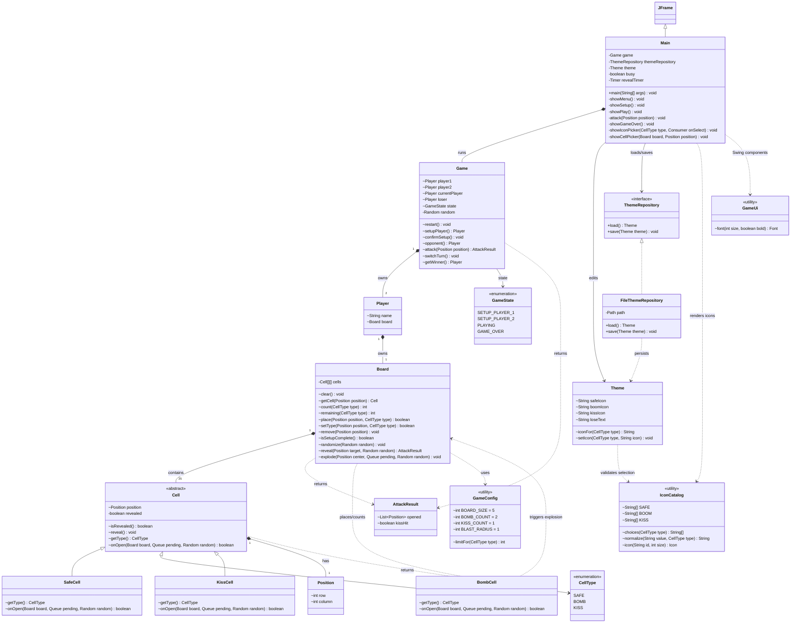

# Boom Boom Kiss - Class Diagram

This diagram describes the final Java game in `week_3`. It shows the
important fields, methods, inheritance, composition, and dependencies.
Package-private Java members use `~`; private members use `-`.

`currentPlayer` and `loser` refer to one of the two players already owned by
`Game`; they do not represent additional players. `AttackResult` contains the
positions opened by an attack and whether the kiss was revealed. The diagram
omits small Swing layout helpers in `Main` so the gameplay relationships stay
readable. The three `Cell` subclasses override `onOpen()`: Safe does nothing,
Bomb asks `Board` to enqueue its random horizontal or vertical blast, and Kiss
reports the losing hit.
