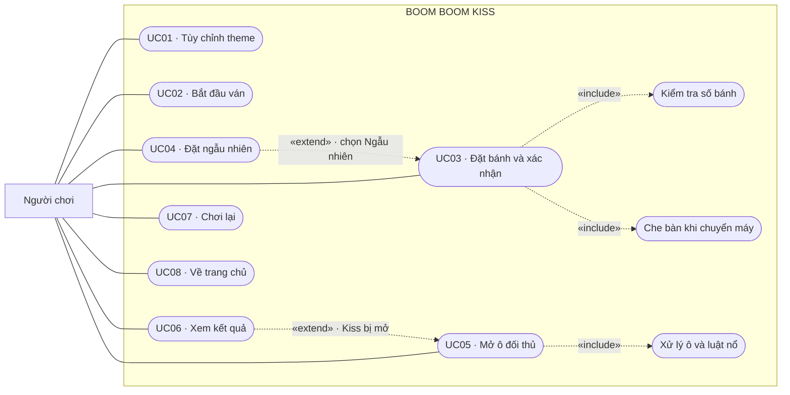

# Use Case — Boom Boom Kiss

## Phạm vi và actor

Hệ thống là game desktop local, gồm GUI, luật chơi và đọc/ghi theme. Actor
duy nhất là **Người chơi**; Người 1 và Người 2 là hai vai trò trong trận.
Game và file properties thuộc bên trong hệ thống, không phải actor bên ngoài.
Không có đăng nhập, server hoặc chơi online.

## Sơ đồ tổng quan

Đây là biểu diễn Use Case bằng Mermaid flowchart để GitHub hiển thị được.
Các đường nối actor chỉ ra chức năng người dùng tương tác; không mô tả thứ tự
thực hiện. Sơ đồ UML với oval/actor chuẩn có nguồn ở `USE_CASE.puml`.

`include` là bước bắt buộc trong một use case; `extend` là hành vi bổ sung khi
thỏa điều kiện. Safe/Boom/Kiss là nhánh xử lý của UC05, không phải ba bước
bắt buộc cùng lúc. Nổ dây chuyền là một nhánh luật; đổi lượt là kết quả của
cú đánh chưa thua, không tạo vòng include giữa các use case.

## UC01 — Tùy chỉnh theme

- Actor: Người chơi trước khi bắt đầu ván.
- Tiền điều kiện: trang chủ đang mở.
- Luồng chính: bấm một trong ba nút icon → chỉ hiện bảng icon của loại đã
  chọn → chọn hình → preview cập nhật và theme lưu vào file. Nhập punishment
  text; text hiện tại được lưu khi chọn icon hoặc bấm Chơi.
- Thay thế: Esc/bấm ra ngoài đóng bảng chọn. Text trống khi bấm Chơi dùng
  mặc định. Không đọc được file thì dùng mặc định; không ghi được file thì
  báo lỗi và vẫn dùng theme trong bộ nhớ để chơi.
- Hậu điều kiện: ba icon và punishment text được dùng trong ván; vị trí bánh
  không được lưu trong file theme.

## UC02 — Bắt đầu ván

- Tiền điều kiện: ở trang chủ, theme đã được chọn hoặc dùng mặc định.
- Luồng chính: bấm Chơi → lưu theme → xóa dữ liệu ván trước → mở setup Người 1.
- Hậu điều kiện: hai bàn đều chưa mở ô, Người 1 đi trước sau khi setup xong.

## UC03 — Đặt bánh và xác nhận

- Actor: lần lượt Người 1 rồi Người 2.
- Tiền điều kiện: màn setup của người tương ứng.
- Luồng chính: bấm ô → bảng chỉ gồm Safe/Boom/Kiss → chọn Boom hoặc Kiss để
  đặt, Safe để xóa → hệ thống cập nhật số bánh → khi đủ 2 Boom/1 Kiss, nút
  Lưu bàn bật → bấm Lưu bàn → kiểm tra số lượng → màn trắng che bàn.
- Thay thế: loại đã đạt giới hạn bị khóa; chọn loại đang có giữ nguyên ô;
  bấm Xóa hết đưa bàn về trống; đóng picker giữ nguyên dữ liệu.
- Hậu điều kiện: Người 1 lưu xong đưa máy và Người 2 bấm Tiếp tục; Người 2
  lưu xong đưa máy lại và Người 1 bấm Bắt đầu. Bàn hợp lệ có 22 Safe, 2 Boom,
  1 Kiss. Không có hai quân cùng một ô.

## UC04 — Đặt ngẫu nhiên

- Tiền điều kiện: đang setup.
- Luồng chính: bấm Ngẫu nhiên → xóa bố trí cũ → chọn ba vị trí khác nhau →
  đặt 2 Boom/1 Kiss → hiển thị bố trí cho người đang setup.
- Hậu điều kiện: đủ bánh để lưu; người chơi vẫn có thể chỉnh trước khi lưu.

## UC05 — Mở ô đối thủ

- Tiền điều kiện: hai bàn đã xác nhận, game ở PLAYING và không đang mở ô.
- Luồng chính: người có lượt bấm một ô chưa mở trên bàn đối thủ → hệ thống
  mở ô, cập nhật số đếm và xử lý loại bánh → giữ kết quả ngắn trong 330 ms →
  tự đổi lượt nếu không thua.
- Quy tắc: Safe chỉ mở; Boom tự chọn ngang/dọc 50/50, mở tối đa một ô mỗi
  phía. Boom gặp trong vùng nổ chọn hướng riêng. Mỗi Boom chỉ nổ một lần;
  bỏ qua ô ngoài bàn và ô đã mở. Kiss trực tiếp hoặc do nổ khiến người đang
  đánh thua. Nếu chỉ còn Kiss, cú đánh vào ô cuối cũng thua.
- Chặn thao tác: không chọn ô đã mở, không chọn bàn của mình, không nhận
  cú bấm tiếp trong 330 ms. Không có popup kết quả mỗi lượt/Pass Turn.
- Hậu điều kiện: chỉ các ô đã mở hiện icon; P2 luôn trên, P1 luôn dưới.

## UC06 — Xem kết quả

- Điều kiện mở rộng UC05: Kiss vừa bị mở.
- Luồng chính: ghi người thua là người kích hoạt cú đánh → đối thủ thắng →
  GAME_OVER → hiện icon Kiss, kết quả và nguyên punishment text.
- Hậu điều kiện: không đánh thêm; có lựa chọn Chơi lại hoặc Trang chủ.

## UC07 — Chơi lại

- Tiền điều kiện: màn kết quả.
- Luồng chính: bấm Chơi lại → xóa bàn/trạng thái ván → setup Người 1.
- Hậu điều kiện: giữ theme và punishment text; phải đặt bánh lại cho cả hai.

## UC08 — Về trang chủ

- Tiền điều kiện: màn setup/chơi/kết quả.
- Luồng chính: bấm nút về trang chủ → dừng timer đang chạy → hiện menu.
- Hậu điều kiện: không có thao tác đổi lượt từ màn cũ; bấm Chơi tạo ván mới.

## Liên hệ với source

UC01: Main, Theme, IconCatalog, ThemeRepository/FileThemeRepository.
UC02/03/04: Main, Game, Board, Cell, Position, GameState.
UC05/06: Game.attack(), Board.reveal(), Cell.getType(), AttackResult.
UC07/08: Game.restart(), các màn/Timer private trong Main.

Kiểm tra chức năng bằng GameTest, ThemeTest và SwingTest. Bản source không
chứa file theme cá nhân; lần chạy đầu dùng mặc định và tự tạo file khi lưu.
